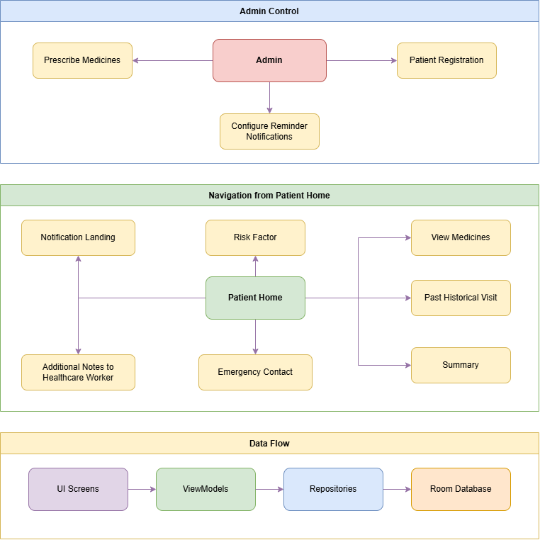

<div align="center">

# Hemalkasa App

### Prenatal Care Management System for Rural Healthcare

[](https://developer.android.com/)
[](https://www.oracle.com/java/)
[](https://gradle.org/)
[](https://developer.android.com/jetpack/room)
[](https://material.io/)

[](LICENSE)
[](https://www.android.com/)
[](https://android-arsenal.com/api?level=24)

</div>

---

## 📋 About The Project

The Hemalkasa App is a comprehensive prenatal care management system designed to streamline healthcare delivery for pregnant women, particularly in rural and underserved communities. This application serves as a bridge between healthcare providers and expectant mothers, ensuring consistent prenatal care through intelligent patient management, appointment scheduling, and educational resources.

### Key Features

- **Patient Management**: Efficient registration and tracking of pregnant women's health records
- **Appointment Scheduling**: Automated reminders for prenatal visits to ensure consistent care
- **Educational Content**: Curated trimester-specific videos covering pregnancy and childbirth
- **Offline Capability**: Full functionality without internet connectivity for rural accessibility
- **Medication Tracking**: Prescription management and dosage reminders
- **Risk Assessment**: Integrated risk factor monitoring and documentation
- **Emergency Contacts**: Quick access to critical healthcare contacts

### Mission

This app is designed to operate seamlessly even in areas with limited internet connectivity, making it accessible to rural communities and villages where access to healthcare resources may be scarce. By functioning offline, the app ensures that pregnant women in remote areas can still receive important reminders for their prenatal appointments and access educational content without relying on consistent internet access. This offline capability extends the reach of maternal healthcare services, empowering healthcare providers to deliver essential care and education to underserved populations, ultimately contributing to improved maternal and child health outcomes in rural areas.

---

## 🏗️ Architecture



### Architecture Overview

The app follows the **MVVM (Model-View-ViewModel)** architecture pattern with the following layers:

- **Presentation Layer**: Activities and Fragments that handle UI interactions
- **ViewModel Layer**: Manages UI-related data and business logic
- **Repository Layer**: Mediates between ViewModels and Data Access Objects
- **Data Access Layer**: Room Database Access Objects (DAOs) for database operations
- **Database Layer**: Room Database built on top of SQLite
- **Utilities**: Helper classes for alarms, text rendering, and gestures

---

## 📱 App Screens

- **MainActivity**: Main navigation hub
- **Patient Registration**: Multi-step patient registration (Pages 1, 2, 3)
- **Patient Home**: Dashboard for patient information and actions
- **Notification Landing**: Appointment and medication reminders
- **Emergency Contact**: Emergency healthcare contacts
- **Notes**: Patient notes and observations
- **Risk Factor**: Risk assessment and monitoring
- **Medicines**: Medication management
- **History**: Patient medical history
- **Summary**: Comprehensive patient summary

---

## 🚀 Getting Started

### Prerequisites

- Android Studio Arctic Fox or later
- JDK 8 or higher
- Android SDK API Level 32
- Minimum SDK API Level 24

### Installation

1. Clone the repository
```bash
git clone https://github.com/pt3002/Hemalkasa-App-Dev.git
```

2. Open the project in Android Studio

3. Sync Gradle files

4. Build and run the application on an emulator or physical device

---

## 🤝 Collaboration

Our app is proud to be in collaboration with:

- **Baba Amte Organization**
- **Lok Biradri Prakalp, Hemalkasa**

This partnership ensures that the application addresses real-world healthcare challenges faced by rural communities in India.

---

<div align="center">

**Built with ❤️ for improving maternal healthcare in rural India**

</div>
